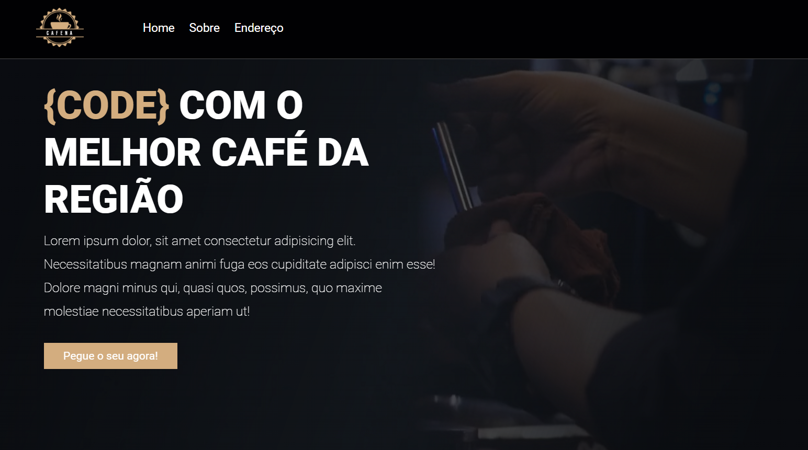

# Website Coffee Cafena

Bem-vindo ao repositório do **Website Coffee Cafena**! Este projeto é um site visualmente atrativo e interativo, desenvolvido para uma cafeteria. Ele combina visuais ricos, conteúdo envolvente e informações essenciais sobre o café.

---

## 📝 Funcionalidades

- **Vídeo na Página Inicial**: Um vídeo cativante para capturar a atenção dos visitantes.
- **Header**: Inclui o logotipo da cafeteria e links de navegação.
- **Seção Sobre Nós**: Destaque para o diferencial do café, com texto descritivo e uma imagem complementar.
- **Modal de Endereço**: Exibe a localização do café no Google Maps ao clicar no link.
- **Botões de Call-to-Action**: Incentiva os usuários a interagir com o site.

---

## 📂 Estrutura do Projeto

O projeto está organizado da seguinte forma:

```
Coffee-Cafena/
│
├── index.html            # Arquivo principal HTML
├── styles.css            # Arquivo de estilo do site
├── script.js             # Arquivo JavaScript para interatividade
├── img/                  # Pasta de imagens
│   ├── logo.png          # Logotipo da cafeteria
│   ├── xicara-de-cafe.png# Favicon
│   ├── about-img.jpeg    # Imagem da seção Sobre Nós
│
├── videos/               # Pasta de vídeos
│   ├── coffee.mp4        # Vídeo da página inicial
```

---

## 📜 Instruções para Executar

1. **Clone o Repositório**:
   ```bash
   git clone https://github.com/obrunochaves/cofee_Cafena.git
   ```
2. **Navegue até o Diretório**:
   ```bash
   cd cofee_Cafena
   ```
3. **Abra o Website**:
   - Abra o arquivo `index.html` em qualquer navegador moderno para visualizar o site.

---

## 🚀 Detalhamento das Funcionalidades

### Header
- Um menu de navegação elegante com links para a página inicial, seção Sobre Nós e um modal para o endereço.

### Vídeo na Página Inicial
- Um vídeo em tela cheia como plano de fundo, com uma sobreposição semitransparente para melhorar a leitura.

### Seção Sobre Nós
- Explica o diferencial da cafeteria com textos envolventes e uma imagem complementar.

### Modal de Endereço
- Uma janela modal com o Google Maps embutido, facilitando a localização do café.

---

## 🔧 Tecnologias Utilizadas

- **HTML5**: Para estruturação do conteúdo.
- **CSS3**: Para estilo e layout.
- **JavaScript**: Para elementos interativos, como o modal.
- **Google Fonts**: Integração de fontes personalizadas para uma tipografia aprimorada.
- **Google Maps Embed API**: Para o modal de endereço.

---

## 📸 Capturas de Tela

### Página Inicial


---

## 🌟 Como Contribuir

1. Faça um fork do repositório.
2. Crie um novo branch:
   ```bash
   git checkout -b nome-da-funcionalidade
   ```
3. Faça commit das suas alterações:
   ```bash
   git commit -m "Adiciona nova funcionalidade"
   ```
4. Faça o push para o branch:
   ```bash
   git push origin nome-da-funcionalidade
   ```
5. Abra um Pull Request.

---

## 📧 Contato

Para dúvidas ou sugestões, entre em contato:

- **Email**: brunochavesdev@gmail.com
- **Telefone**: +55 27 99734-1557

---

## ⚠️ Licença

Este projeto é open-source e está disponível sob a [Licença MIT](LICENSE).
